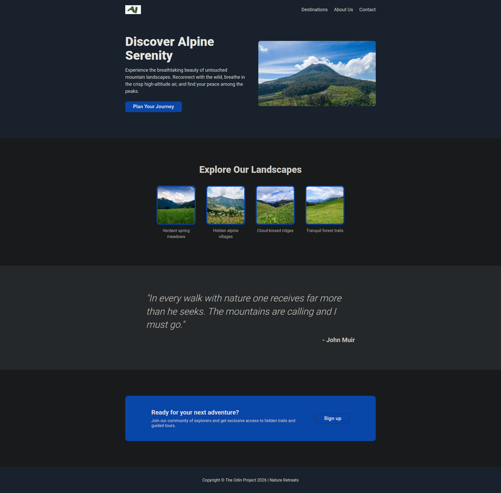

# Alpine Serenity Landing Page

A landing page project built as part of **The Odin Project Foundations Course**. The goal of this project was to recreate a provided design while applying modern HTML and CSS layout techniques.

## Live Preview

🔗 https://santhedeveloper.github.io/landing-page/

## Screenshot

## Project Overview

Alpine Serenity is a fictional nature retreat landing page designed to showcase scenic destinations and encourage visitors to sign up for future adventures.

The project focuses on building a complete webpage from a design mockup using semantic HTML and Flexbox.

## Technologies Used

- HTML5
- CSS3
- Flexbox
- Git
- GitHub

## Features

- Semantic HTML structure
- Navigation bar with internal page links
- Hero section with call-to-action button
- Information card section
- Testimonial/quote section
- Call-to-action signup section
- Footer section
- Custom branding and content
- Flexbox-based layouts

## What I Learned

### HTML

- Structured webpages using semantic elements:
  - `<header>`
  - `<nav>`
  - `<main>`
  - `<section>`
  - `<footer>`
  - `<blockquote>`

- Created accessible navigation links
- Wrote meaningful image alt text
- Organized content into logical, reusable groups

### CSS

- Applied a CSS reset
- Used the CSS Box Model
- Styled typography, buttons, images, and links
- Used Flexbox for:
  - Horizontal layouts
  - Vertical layouts
  - Alignment
  - Spacing
  - Content distribution

- Styled images using:
  - `max-width`
  - `object-fit`
  - `border-radius`

- Created hover effects with CSS transitions

### Layout & Design

- Translated a visual design mockup into code
- Broke a page into logical sections
- Built reusable card components
- Created consistent spacing and alignment
- Centered content using containers and auto margins

## Challenges Faced

- Choosing appropriate semantic HTML elements
- Structuring the hero section layout
- Organizing Flexbox containers and child elements
- Building reusable card components
- Maintaining clean and readable HTML structure

## Future Improvements

- Add responsive design for tablets and mobile devices
- Replace external image URLs with local assets
- Add smooth scrolling navigation
- Improve accessibility
- Add animations and interactive effects

## Credits

- Project assignment provided by **The Odin Project**
- Images sourced from **Unsplash**
